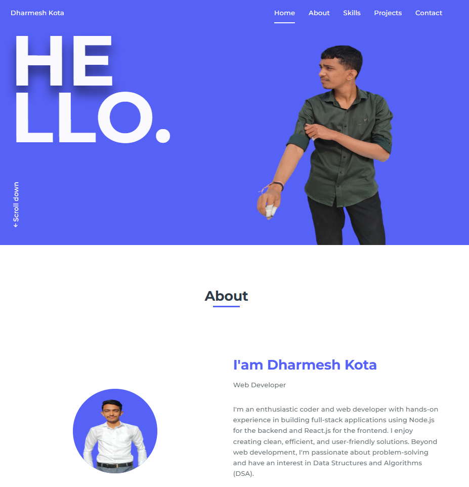
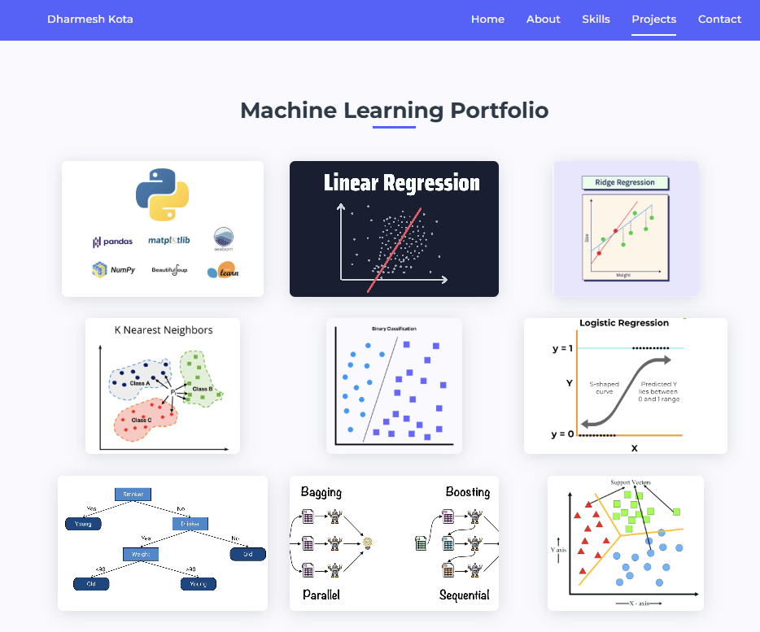

# Dharmesh Kota — Portfolio

Welcome to my Machine Learning project portfolio! This repository contains a curated set of practical assignments that demonstrate my understanding and implementation of core ML concepts, from foundational regression techniques to advanced ensemble learning and optimization methods.

---

## 🌐 Website Preview

Here’s a quick preview of how my portfolio website looks:

### 📸 Home

### 📸 Portfolio

---

## 🚀 About Me

I'm a B.Tech. Mathematics and Computing student passionate about Machine Learning, Web development, and Problem Solving. This portfolio showcases my journey through various hands-on assignments designed to build a strong foundation in applied ML techniques.

---

## 🧠 Skills Covered

- Supervised Learning
- Regression (Linear, Ridge, Lasso)
- Classification (Logistic Regression, Perceptron, Naïve Bayes, SVM)
- Decision Trees & Ensemble Learning (Bagging, Boosting, Random Forest)
- Unsupervised Learning (K-Means Clustering)
- Model Evaluation (Bias-Variance Trade-off, Confusion Matrix)
- Optimization (Gradient Descent, Momentum, Newton’s Method)

---

## 📁 Projects

### 1. **Linear and Polynomial Regression**
- Implemented univariate and multivariate regression using both normal equation and gradient descent.
- Visualized training/test error and learned weights for different polynomial degrees.

### 2. **Bias-Variance & Regularization Study**
- Explored model capacity, underfitting vs. overfitting, L1 (Lasso) and L2 (Ridge) regularization.
- Plotted training/test error across λ values and analyzed sparsity in Lasso.

### 3. **Naïve Bayes Classifier**
- Implemented Naïve Bayes with various priors, Laplace smoothing, and histogram visualizations.
- Used synthetic Gaussian datasets and analyzed classification accuracy under different class distributions.

### 4. **Logistic Regression on Social Network Ads**
- Visualized decision boundaries in 3D.
- Implemented logistic regression using:
  - Stochastic Gradient Descent
  - Gradient Descent with Momentum + Regularization
  - Newton’s Method (IRLS)
- Evaluated model with confusion matrix (Accuracy, Precision, Recall, F1).

### 5. **Multiclass Logistic Regression — Iris Dataset**
- Performed classification with logistic regression using IRLS and momentum methods.
- Visualized 3D class separation and compared convergence speed and accuracy.

### 6. **Decision Trees — Classification & Regression**
- Classification on CarEvaluation dataset with entropy/gini splitting.
- Regression on Boston Housing dataset with pruning.
- Plotted average accuracy vs. complexity α, regression curves for MEDV vs features.

### 7. **Decision Trees with Ensemble Learning**
- Performed Bagging and Random Forests for both classification and regression.
- Used cross-validation to tune B and compared original trees with ensemble results.
- Analyzed model variance and performance improvements.

### 8. **Boosting & Comparative Analysis**
- Implemented AdaBoost for classification and Gradient Boosting (GBRT) for regression.
- Compared performance of pruned trees, bagging, and boosting on accuracy, MSE, and training time.

### 9. **SVM & K-Means Clustering**
- Trained hard/soft margin SVMs using:
  - Custom dual solvers with CVXPY
  - Scikit-learn’s implementation
- Visualized hyperplanes, support vectors, and margins.
- Implemented K-Means from scratch, used elbow method to find optimal K, and visualized cluster formations.

---

## 🛠️ Technologies Used

- Python, NumPy, pandas, matplotlib, seaborn, scikit-learn
- CVXPY for optimization in SVMs
- Google Colab for visualizations and experimentation
- Git/GitHub for version control

---

## 📫 Contact

- 📧 Email: dharmeshkota123@example.com
- 🌐 [LinkedIn](https://www.linkedin.com/in/dharmesh-kota-8a9810268/)
- 💼 Portfolio Website: [yourname.github.io](https://dharmesh-kota.github.io/Portfolio/)

---

Feel free to check out the individual assignment folders for detailed notebooks and visualizations!